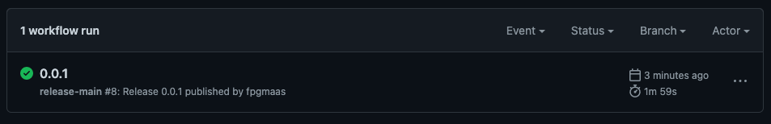
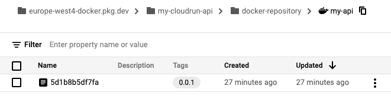
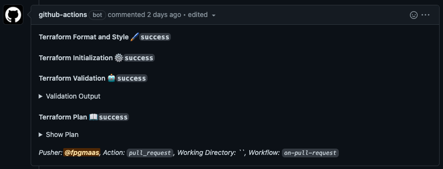

import TextBox from "../../components/utils/TextBox.js"
import { Link } from "gatsby"


In the <Link to="/blog/deploying-a-flask-api-to-cloudrun">previous tutorial</Link>, we deployed a 
Flask API to Google Cloud Run by creating two repositories. One with a Flask API and a Dockerfile, and another with
Terraform files to provision our infrastructure to GCP. At the end of the tutorial, we reduced the deployment
of our API and our infrastructure to just a few simple commands that we could run locally. While that is already a great improvement
over performing all the steps manually, it's not yet where we would want to be if we were to use this API in a production environment.
The two most important features that are missing are the use of a **backend for Terraform** and the ability to **trigger deployments through 
CI/CD**. In this tutorial, we will aim to cover these topics.
The source code for this tutorial can be found here:

- [API](https://github.com/fpgmaas/cloudrun-example-api)
- [infrastructure](https://github.com/fpgmaas/cloudrun-example-infra)

<TextBox
  type="info"
  text=<span>
    Although our starting point for this tutorial is the code from the previous tutorial,
    which you can find <a href ="https://github.com/fpgmaas/cloudrun-example-infra/tree/blogpost1" target = "_blank">here</a>
    &nbsp;and <a href ="https://github.com/fpgmaas/cloudrun-example-api/tree/blogpost1" target = "_blank">here</a>,
    we will assume we have not provisioned the infrastructure or the API yet. If you have the infrastructure 
    from the previous tutorial still deployed, run <code>terraform destroy</code> before starting with this tutorial.
  </span>
></TextBox>


## 1. Configuring the backend for Terraform

Terraform must store state about your managed infrastructure and configuration. This state is used by 
Terraform to map real world resources to your configuration, keep track of metadata, 
and to improve performance for large infrastructures. By default,
this state is stored locally in the file `terraform.tfstate`. However, if we want to provision our infrastructure through CI/CD
we should use a [backend](https://www.terraform.io/language/state/backends) for Terraform, so our state is stored remotely. 

There are multiple available backends for Terraform. A comprehensive list can be found in the sidebar of 
[this page](https://www.terraform.io/language/settings/backends). Since we are using GCP, we will use the `gsc`
(Google Cloud Storage) backend.

First, we need to create a bucket in Google Cloud Storage so we can store our state files there.
This is a step that we only need to execute once when initiating the project, so we could do this manually through the UI. 
However, since we might want to do this in multiple projects and to make our approach reproducible, we will also create this
bucket using Terraform.
To do so, we start with the [repository](https://github.com/fpgmaas/cloudrun-example-infra/tree/blogpost1) we created last time. Since we want
to use this code only once per project while we want the rest of the Terraform code to run during every deployment, we 
create a new directory called `backend` with the files `main.tf` and `variables.tf`:

`backend/main.tf`

```json
terraform {
  required_providers {
    google = {
      source  = "hashicorp/google"
      version = "4.25.0"
    }
  }
}

provider "google" {
  project = var.project_id
  region  = var.region
}

# Enable storage API
resource "google_project_service" "storage" {
  provider           = google
  service            = "storage.googleapis.com"
  disable_on_destroy = false
}

# This is used so there is some time for the activation of the API's to propagate through 
# Google Cloud before actually calling them.
resource "time_sleep" "wait_30_seconds" {
  create_duration = "30s"
  depends_on = [google_project_service.storage]
}

// Terraform plugin for creating random IDs
resource "random_id" "instance_id" {
  byte_length = 8
}

resource "google_storage_bucket" "default" {
  name          = "bucket-tfstate-${random_id.instance_id.hex}"
  force_destroy = false
  location      = var.region
  storage_class = "STANDARD"
  versioning {
    enabled = true
  }
  depends_on = [time_sleep.wait_30_seconds]
}

output "bucket_name" {
  description = "Terraform backend bucket name"
  value       = google_storage_bucket.default.name
}
```

`backend/variables.tf`

```json
variable "project_id" {
  description = "The name of the project"
  type        = string
  default     = "my-cloudrun-api"
}

variable "region" {
  description = "The default compute region"
  type        = string
  default     = "europe-west4"
}
```

With our knowledge of the previous tutorial, this is all pretty straightforward. The only resources that we have 
not encountered before are the `random_id` and the `google_storage_bucket`. The `random_id` is used to create a 
string of random characters to be appended to the name of our storage bucket, since the bucket names have to be globally unique.
`google_storage_bucket` is used - not surprisingly - to create the storage bucket.

## 2. Creating the backend

To create the backend we have to run `terraform apply`, this time using the [`chdir`](https://www.terraform.io/cli/commands#switching-working-directory-with-chdir)
argument. This argument enables us to change the working directory for the Terraform commands that we run. We also need to use
the service account key that we created in the <Link to="/blog/deploying-a-flask-api-to-cloudrun#5-deploying-our-cloud-infrastructure-with-terraform">previous tutorial</Link>
again. There is a small change that we should make before we can do this though. Last time, we set the path to our service account 
as a relative path in our `.env` file. However, since we are going to change the working directory for our `terraform apply`
command this time, we should change this to an absolute path. So we change the `.env` file from 

```bash
export GOOGLE_APPLICATION_CREDENTIALS="infra_service_account.json"
```

to 

```bash
export GOOGLE_APPLICATION_CREDENTIALS="/Users/fpgmaas/git/cloudrun-example-infra/infra_service_account.json"
```

Now, we are ready to create our storage bucket:

```bash
source .env
terraform -chdir=backend validate
terraform -chdir=backend apply
```

This will apply our changes and output the name of the created bucket to the terminal.
Copy the name of your bucket to the clipboard, because we are going to need it later. 

## 3. Configuring Terraform to use the backend

Now it's time to configure Terraform to use this backend to store its state files. For that, we 
simply follow the instructions from [this section](https://www.terraform.io/language/settings/backends/configuration) of the Terraform documentation.
But before we do that, we move the `main.tf` and `variables.tf` files we created in the previous tutorial (so not those
that we just created in the `backend` directory!) to a directory called `main`.
Then, within this directory we create a file called `backend.tf` with the following contents:

```json
terraform {
  backend "gcs" {
    bucket = "bucket-tfstate-f38f0b132659d977"
    prefix = "terraform/state"
  }
}
```

Where we set `bucket` to the value that we copy-pasted when we created the backend. Our directory structure should now look as follows:

```log
├── backend
│   ├── main.tf
│   ├── terraform.tfstate
│   ├── terraform.tfstate.backup
│   └── variables.tf
├── main
│   ├── backend.tf
│   ├── main.tf
│   └── variables.tf
└── infra_service_account.json
```


## 4. Provisioning the initial infrastructure

When we attempted to provision the infrastructure for the first time with `terraform apply` in the previous tutorial, we got an 
error that the Docker image required to create the Cloud Run instance could not be found. This was expected, since we needed to ceate the
repository before we could push our Docker image to the cloud. Although this did not create any problems, it also does not feel very clean
to expect an error when running our code. Instead, we are going to add a variable to `main/variables.tf`, indicating if we are provisioning our 
infrastructure for the first time:

```json
variable "first_time" {
  description = "Boolean flag to indicate if this is the first time the application is running. If so, the cloud run step is omitted"
  type        = bool
  default     = true
}
```

We can use this argument to only create a subset of our infrastructure when we provision it for the first time.
If `first_time` is `true`, we want Terraform to create all infrastructure except the Cloud Run instance. If `first_time`
is set to `false`, we want Terraform to create all infrastructure *including* the Cloud Run instance. To do so, we can add a `count` argument 
with a conditional expression. The `count` argument specifies the number of resources that should be created within a block. In our case, we
want to set that to `1` or `0`, dependent on the value of `first_time`. A conditional expression in Terraform has the following syntax:

```bash
condition ? true_val : false_val
```

so we can achieve what we want by adding `count = var.first_time ? 0 : 1` to all resource blocks in the section "`Deploy API to Google Cloud Run`".
For example:

```json
# Deploy image to Cloud Run
resource "google_cloud_run_service" "api_test" {
  provider = google-beta
  count = var.first_time ? 0 : 1
```

This conditional statement tells Terraform to create one copy of this resource if `first_time` is set to `false`, 
and zero copies if it's set to `true`. Since we are using `count`, Terraform distinguishes between the block and the 
resource or module instances within it, so we have to append `[0]` whenever we reference this block to specify
that we want to use the first resource within the block. For example:

```json
service  = google_cloud_run_service.api_test.name
```

becomes

```json
service  = google_cloud_run_service.api_test[0].name
```

Lastly, we also have to make the output conditional, since there is no URL for the API to return if we do not create the API.
To do so, we replace our output statement with

```json
output "cloud_run_instance_url" {
  value = var.first_time ? null : google_cloud_run_service.api_test[0].status.0.url
}
```

This returns `null` if `first_time` is `true`, and it returns the URL of the deployed API otherwise.

Assuming we already have sourced our `.env` file, we can now run the following commands to create our initial infrastructure.

```bash
terraform -chdir=main init
terraform -chdir=main apply
```

## 5. Pushing our Docker image with Github Actions

Now we should push our Docker image to the created Artifact Registry. Last time, we did this manually, but now
we are going to use GitHub Actions to do that for us. As our starting point, we use the 
[repository](https://github.com/fpgmaas/cloudrun-example-api/tree/blogpost1) that we created during the previous tutorial.

<TextBox
  type="info"
  text=<span>
   Starting from this step, we can no longer work with local directories, but we have to use GitHub repositories. So if you have not done so yet,
now is the time to move your code <a href= "https://docs.github.com/en/get-started/importing-your-projects-to-github/importing-source-code-to-github/adding-locally-hosted-code-to-github" target = "_blank">
from your local machine to GitHub</a>.
  </span>
></TextBox>


To deploy our Docker image using GitHub Actions, we add a file `.github/workflows/on-release-main.yml` with the following contents:

```yml
on:
  release:
    types: [published]
    branches: [main]

name: release-main

jobs:

  Release:
    runs-on: ubuntu-latest
    steps:
    
      - name: Check out
        uses: actions/checkout@v2

      - name: Set up poetry
        uses: ./.github/workflows/setup-poetry-env

      - name: Authenticate GCP
        uses: 'google-github-actions/auth@v0'
        with:
          credentials_json: '${{ secrets.DOCKER_PUSHER_SERVICE_ACCOUNT_KEY }}'

      - name: Get tag
        id: vars
        run: echo ::set-output name=tag::${GITHUB_REF#refs/*/}

      - name: Set up gcloud SDK
        uses: 'google-github-actions/setup-gcloud@v0'

      - name: Configure docker for GCP
        run: gcloud auth configure-docker europe-west4-docker.pkg.dev

      - name: Build docker image
        run:  docker build . -t europe-west4-docker.pkg.dev/my-cloudrun-api/docker-repository/my-api:${RELEASE_VERSION}
        env:
            RELEASE_VERSION: ${{ steps.vars.outputs.tag }}

      - name: Push to Google Container Registry
        run:  docker push europe-west4-docker.pkg.dev/my-cloudrun-api/docker-repository/my-api:${RELEASE_VERSION}
        env:
            RELEASE_VERSION: ${{ steps.vars.outputs.tag }}
```

Let's take a closer look at this file. The first section specifies that we want this workflow to run
on every release from the `main` branch. Releases are a great feature on GitHub that work with git `tags`, you can find
more information about it [here](https://docs.github.com/en/repositories/releasing-projects-on-github/managing-releases-in-a-repository).

Next, we checkout our code and set up poetry. For setting up poetry, we see that another file in our repository is required. 
Create a new file `.github/workflows/setup-poetry-env/action.yml` and simply copy-paste the contents from 
[this file on GitHub](https://github.com/fpgmaas/cloudrun-example-api/blob/main/.github/workflows/setup-poetry-env/action.yml). 
For the scope of this tutorial, it suffices to know that this sets up your Poetry environment, so we will not elaborate on the contents of this file.

In the next step, we use the [auth action](https://github.com/google-github-actions/auth) from google-github-actions
to authenticate our Google Cloud connection. This requires us to set `DOCKER_PUSHER_SERVICE_ACCOUNT_KEY` as a 
[secret](https://docs.github.com/en/codespaces/managing-codespaces-for-your-organization/managing-encrypted-secrets-for-your-repository-and-organization-for-codespaces) 
in our repository. With Terraform we created our `docker-pusher` service account, so navigate to 
[Service Accounts](https://console.cloud.google.com/iam-admin/serviceaccounts) within the Google Cloud Console, 
create a new service account key, and copy its contents as the value for the secret `DOCKER_PUSHER_SERVICE_ACCOUNT_KEY` in your repository.

The next step takes the tag from the current release, and stores it as an output for use in later steps of the workflow. We then use another
action from google-github-actions to setup the `gcloud` CLI.
The following steps are all exactly the same as those in <Link to="/blog/deploying-a-flask-api-to-cloudrun#6-pushing-the-docker-image-to-artifact-registry-on-google-cloud">this section</Link>
of the previous tutorial, the only change being the addition of the release version to the docker image tag.

Now that we have added the GitHub Actions workflows, we commit and push the changes to the `main` branch of our git repository, 
and create a new release with the tag `0.0.1` through the GitHub UI. After a few minutes we should see that our Action has completed succesfully:



And if we navigate to the [Artifact Registry](https://console.cloud.google.com/artifacts/) in the Google Cloud Console, we should see
our Docker image along with the tag we used for our release:



# 6. Provisioning our infrastructure with GitHub Actions

As a recap, here's a list of what we have already achieved during this tutorial:

- Configured and created the backend
- Configured Terraform to use the backend
- Initiated our Terraform infrastructure
- Deployed our Docker image to Artifact Registry through GitHub Actions.

All that's left for us to do now is to provision the Terraform infrastructure *including* the Cloud Run instance through GitHub Actions. To do so,
we add a file `.github/workflows/on-release-main.yml` with the following contents:

```yaml
on:
  release:
    types: [published]
    branches: [main]

name: release-main

jobs:
  terraform:
    name: 'Terraform'
    runs-on: ubuntu-latest

    defaults:
      run:
        shell: bash
        working-directory: ./main

    steps:
      - name: Checkout
        uses: actions/checkout@v2

      - name: Setup Terraform
        uses: hashicorp/setup-terraform@v2
        with:
          terraform_version: 1.1.7

      - name: Terraform fmt
        id: fmt
        run: terraform fmt -check

      - name: Terraform init
        id: init
        run: terraform init
        env:
          GOOGLE_CREDENTIALS: ${{ secrets.GOOGLE_CREDENTIALS }}

      - name: Terraform validate
        id: validate
        run: terraform validate -no-color

      - name: Terraform plan
        id: plan
        run: terraform plan -no-color
        env:
          GOOGLE_CREDENTIALS: ${{ secrets.GOOGLE_CREDENTIALS }}

      - name: Terraform apply
        id: apply
        run: terraform apply -auto-approve
        env:
          GOOGLE_CREDENTIALS: ${{ secrets.GOOGLE_CREDENTIALS }}
```

The workflow is relatively straightforward. On every release, the working directory is changed to `main`, 
Terraform is set up, the working directory is initialized, and then the `validate`, `plan` and `apply` steps are performed. 
Note that our workflow is dependent on the secret `GOOGLE_CREDENTIALS` being available, so we also need to add our infrastructure 
service account key to the repository. To do so, simply copy and paste the contents of `infra_service_account.json` to the secret called
 `GOOGLE_CREDENTIALS` in our repository, similar to how we did that for pushing our Docker images through GitHub Actions.

Optionally, also add a file called `on-pull-request.yml` to the workflows directory. The file is relatively long, so instead of 
showing the contents of that file on this page, you can find it [here](https://github.com/fpgmaas/cloudrun-example-infra/blob/main/.github/workflows/on-pull-request.yml).
This workflow will run on every pull request, and it will automatically run the `fmt`, `validate`, and `apply` steps with the proposed changes.
It will then add the output of these steps in a comment to the Pull Request, so the proposed changes can easily be evaluated:



Before we commit our changes and push them to our repository, we set the value of `first_time` in `main/variables.tf` to `false` and we set the 
value of `docker_image` to `my-api:0.0.1`, since we used the tag `0.0.1` to release our API earlier.

Then we create a new branch with the name `cicd` and commit and push our changes to that branch:

```bash
git checkout -b cicd
git add .
git commit -m 'configured backend and added CI/CD'
git push origin cicd
```

Navigate to your repository on GitHub and create a Pull Request from the `cicd` branch into `main`, and within half a minute we should see a comment 
from the `github-actions bot` in our Pull Request with the proposed changes. Review the Terraform plan, and then merge the pull request. To finalize our 
deployment create a new release on `main` with the tag `0.0.1` (the tag does not necessarily have to be the same as the tag we used for our Docker image,
but in this case it makes sense to do so). A new GitHub Action should be started which should take about a minute to run. To find our API's URL,
we can navigate to `Actions > All workflows > 0.0.1 > Terraform > Terraform apply`, where we can find the following output:

```log
Apply complete! Resources: 2 added, 0 changed, 0 destroyed.
Outputs:
cloud_run_instance_url = "https://<some-link>.a.run.app"
```

And when we open the link, we see the result of all our hard work!

...

...

`Hello, World!`

Slightly anticlimactic for two full tutorial's worth of work. 

But hey, this was just the start! Now we can start to actually develop our API and extend the infrastructure. 
Developing, extending, deploying and collaborating on whatever it is we want to build should be a hundred
times easier now that we've we've spend some time developing a solid basis to start from.

There's also still room left for improvement. We can remove some of the hardcoded variables in our GitHub workflows and
replace them with environment variables. Also our `main/main.tf` file has become quite long,
maybe we should spend some time refactoring it into modules. That will also reduce the explicit `depend_on` and `count`
statements that we have written. Another important feature that is still missing is the support for multiple staging environments.

But that's out of scope for this tutorial, it's already long enough. I hope it was helpful, if you have any feedback; please let me know.